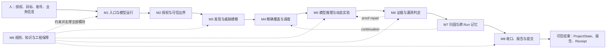
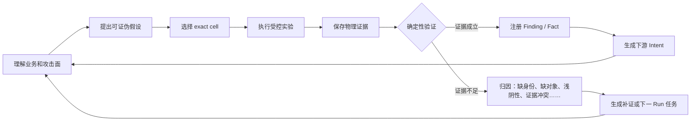

# Atoolkit v9.0 整体架构、模块、文件与 Prompt 使用手册

版本：9.0.0  
日期：2026-07-19  
适用读者：项目维护者、SRC 测试负责人、模型适配器开发者、证据审核人员

阅读建议：只想快速理解项目，先看第 4、5 节；想运行项目，再看第 6、7、13 节；想维护代码，直接查第 9、18 节；想提高模型效率，看第 14～17 节。

## 1. 一句话理解这个项目

Atoolkit 不是“给大模型一段安全测试提示词”，而是一套把大模型放进确定性工程合同里的授权 SRC 研究系统：模型负责理解业务、提出假设和执行探索；Host 代码负责授权边界、覆盖分母、证据绑定、结果归因、跨 Run 真值和最终报告资格。

白话说：模型像研究员，Atoolkit 像实验室、项目经理、审计员和档案系统。研究员可以换，但实验规则、证据规则和档案真值不跟着模型变化。

## 2. 为什么要这样设计

单靠 Prompt 的安全测试容易出现八类问题：

1. 模型忘了某些端点或参数，却说“测完了”；
2. 只看到 HTTP 200、500、CORS、Token 字段就写成漏洞；
3. 没有原始请求响应，却靠散文声称 PoC 成立；
4. 手工 `final_report.md` 绕过结构化 Finding 和覆盖状态；
5. 覆盖率按“访问过端点”统计，而不是按参数、角色、漏洞类统计；
6. 后一轮阴性把前一轮真漏洞静默覆盖，或者相反；
7. 新发现只留在当轮聊天里，没有成为下一轮任务；
8. 更换模型后，执行格式、证据标准和报告口径全部漂移。

v9.0 的设计目标不是保证每次挖全，而是让每个结果都可解释、每个遗漏都可见、每个 Finding 都可复验、每次跨 Run 都能续上业务理解。

## 3. 最重要的五个设计原则

### 3.1 模型负责推理，代码负责裁决

模型可以提出 `CANDIDATE`、`NONE`、Fact、Intent 和执行事件，但不能靠一句“已确认”直接写入项目真值。最终状态由 JSON 合同、物理证据和 Python 验证器决定。

### 3.2 状态在磁盘，不在对话记忆

长对话会压缩、模型会遗忘，所以 inventory、coverage、candidate、execution、Finding、negative、ProjectState、receipt 都落盘。Prompt 每轮只注入当前最需要的 Top 队列和状态摘要。

### 3.3 覆盖分母必须冻结

当前 Run 的分母在模型执行前由 Host 冻结。运行中发现的新端点不会偷偷扩大当前覆盖率，而是进入 backlog、miss attribution 和 next-run agenda，在新 sibling Run 中正式规划。

### 3.4 报告是投影，不是真值来源

`final_report.md` 只能由 finalizer 从已验证 Finding 投影生成。Markdown 摘要、聊天结论、`findings_summary.md` 都不能反向升级项目真值。

### 3.5 跨 Run 只继承精确闭格

闭格身份至少是：

```text
asset/origin + namespace + METHOD/path + param/location
+ actor/subject/object + vuln_class
```

同一路径不同方法、参数、角色或漏洞类，都是不同测试单元。unknown role 不是通配符。

## 4. 整个项目到底有几个模块

按运行职责划分，Atoolkit v9.0 有 **9 个核心模块**。这 9 个模块不是按目录机械切分，而是按“一个授权测试从输入到可信结果”所经历的职责切分。



一眼看懂这张图：主链从 M1 走到 M8；M6 发现证据不足会退回 M5 补证；M7 把未完成工作送回下一 Run 的 M4；M9 不直接测试目标，而是给所有模块提供规则、知识、测试和维护保障。

| 模块 | 一句话功能 | 主要输入 | 主要输出 | 解决的核心问题 | 激发的模型能力 |
|---|---|---|---|---|---|
| M1 入口与模型运行 | 把人的任务变成一次受控 Run | CLI 参数、授权、身份、模型 | session、adapter、运行结果 | 启动方式混乱、模型绑定过死 | 换模型不换系统、持续执行 |
| M2 授权与可信边界 | 冻结谁、何时、可测什么 | target、scope、源码、指令 | identity、manifest、run plan | 越界、伪造真值、文件篡改 | 在清晰边界内大胆探索 |
| M3 发现与威胁建模 | 把页面流量变成业务安全问题 | HTML/JS/JSON/HAR、inventory | Feature、Threat、exact cells | 固定漏洞清单、攻击面遗漏 | 业务理解、威胁建模、因果推理 |
| M4 精确覆盖与调度 | 决定测哪些格、先测什么 | cells、项目历史、预算 | ledger、run scope、queue | 虚假覆盖、随机重测 | 专注高价值任务、减少重复 |
| M5 模型推理与动态实验 | 驱动每轮思考和证据实验 | queue、知识卡、Fact/Intent | observation、candidate、evidence | 对话遗忘、浅尝辄止 | 创造性探索、追链、自我修正 |
| M6 证据与漏洞判定 | 把现象筛成可证明结果 | Finding、HTTP 包、PoC | accepted/rejected、closure | 无证据 Finding、垃圾洞 | 从猜测升级为严谨证明 |
| M7 归因与跨 Run 记忆 | 解释每个未命中并续航 | validation、open cells、历史 | ProjectState、attribution、agenda | 静默遗漏、每轮重新随机 | 长期记忆、反思、连续研究 |
| M8 收口、报告与提交 | 事务化生成可信交付 | frozen evidence、validation | report、receipt、delivery | 手工报告绕真值、重复提交 | 把研究成果稳定产品化 |
| M9 规则、知识与工程保障 | 维持跨模型一致性 | 规则、cards、tests、设计记录 | Prompt 合同、回归结果 | 规则漂移、版本退化 | 获得稳定方法论和即时知识 |

## 5. 九个模块逐一拆解

### 5.1 M1：入口与模型运行模块

#### 这个模块是干什么的

它是项目的“驾驶舱”。人只需要告诉它目标、授权、账号标签、Recon、预算和模型，它负责创建正确目录、选择运行模式、接上模型并把结果交给后续模块。

#### 输入 → 处理 → 输出

```text
CLI/Skill 参数
→ 校验参数组合和运行模式
→ 建 project/session
→ 选择 Mock/Codex/Direct/Wrapper
→ 调用 Planning 和 orchestrator
→ 返回 coverage、Finding、delivery 和退出码
```

#### 达到的效果

- 同一套 Engine 可以换模型、换运行入口；
- dry-run、live、Direct、Wrapper 使用同一证据和最终验证合同；
- 人不需要手工串几十个内部模块。

#### 解决的问题

解决“脚本很多但不知道先运行谁”“换模型要重写整个系统”“中断后不知道怎么恢复”。

#### 激发的模型潜力

模型不再承担目录管理、状态持久化和终态拼装，可以把上下文集中在业务理解和当前实验上。

| 文件 | 用来处理什么 | 核心处理逻辑 | 达到的效果 | 解决的问题 |
|---|---|---|---|---|
| `run.py` | 用户命令和完整 Engine 生命周期 | 解析 target/authz/identity/recon/预算；创建 project/session；选择 planning mode 和 adapter；调用 `run_session`；展示 coverage、Guardian、delivery；路由 `score/audit/submission/doctor/self-check` | 一条命令串起完整 Run | 内部模块多、人工接线易错 |
| `codex/codex_adapter.py` | Codex CLI 模型进程 | 实现 ModelAdapter；启动 `codex exec`；流式返回；识别模型/用量错误；清理进程组；声明 containment 能力 | 模型成为可替换部件 | orchestrator 与某个模型强耦合 |
| `engine/skill_runtime.py` | Direct/Qoder 多 Agent 诊断运行 | `preflight/init/observe/checkpoint`；保存 immutable observation；合并 ledger/candidate/execution；固定 untrusted | 没有 Engine 外壳时仍有机器状态 | 多 Agent 只靠聊天同步、结果不可复验 |
| `engine/skill_wrapper.py` | 外部 Host 管理 Skill 生命周期 | 创建 authority/plan；验证 command/workdir；启动 Agent；停止/检查进程；调用 shared finalizer；containment 不足就 fail closed | 为未来可信容器执行预留标准入口 | Agent 自己给自己授权、自己宣布完成 |

### 5.2 M2：授权与可信边界模块

#### 这个模块是干什么的

它是“门禁、保险柜和公证处”。它不决定怎么找漏洞，只决定允许碰哪里、哪些输入在模型执行前已经冻结、哪些文件可信。

#### 输入 → 处理 → 输出

```text
target + allow/deny scope + project path + source/instruction/model identity
→ URL 规范化、身份键规范化、防篡改写入、哈希绑定
→ project identity + manifest + frozen run plan + authority event chain
```

#### 达到的效果

- 越界 URL 不能因为字符串相似被误放行；
- 模型不能执行后再伪造“原计划就是这些”；
- 文件软链接、硬链接和并发写不能轻易污染父级真值；
- Run 可以证明使用了哪个版本、规则和模型。

#### 解决的问题

解决授权漂移、路径逃逸、模型自我授权、运行后补写分母、证据与版本无法对应。

#### 激发的模型潜力

边界越明确，模型越能在合法范围内进行大胆、开放的研究，而不必把大量注意力消耗在反复确认边界上。

| 文件 | 用来处理什么 | 核心处理逻辑 | 达到的效果 | 解决的问题 |
|---|---|---|---|---|
| `engine/host_policy.py` | 授权 URL、host、port、path | 结构化解析 URL；精确 host/port；wildcard 需显式；校验 Host header | 授权判断一致 | `evil-example.com` 一类后缀误匹配 |
| `engine/safe_io.py` | 父级和 session 文件读写 | `O_NOFOLLOW` 逐级目录 FD；原子写、exclusive create、append、fsync、锁、单硬链接检查 | 模型可写目录仍能 fail closed | symlink/hardlink/TOCTOU 篡改 |
| `engine/data_hygiene.py` | 凭据和 PII | 扫描并稳定脱敏 Cookie、Authorization、Token、Key、密码、邮箱、手机号；计算 credential hash | Planning/报告不泄密，原始 evidence 保真 | 敏感信息进入 Prompt 和报告 |
| `engine/cell_identity.py` | exact cell 身份 | 统一 asset/method/path/param/role/vuln/dimensions；生成 runtime/project key | 一个测试结论只能关闭对应格 | 不同角色、参数或资产串格 |
| `engine/surface_key.py` | surface/cell 字符串键 | 规范 `METHOD /path` 和 `:: param × class` | scheduler、ledger、budget 用同一键 | 各模块对同一端点叫法不同 |
| `engine/run_authority.py` | Host 项目身份和 Run 分母 | 自哈希 identity；create-only run plan；冻结 method resolution；append-only event；target fingerprint | 模型运行前已有权威计划 | 运行后扩张或改写计划 |
| `engine/runtime_manifest.py` | Run provenance 和 receipt 基础 | 绑定源码树、指令、模型、adapter、scope、Planning lineage；验证 manifest；生成/验证 receipt 和 anchor chain；doctor | 结果可追溯到精确运行环境 | “这份结果到底是哪版代码跑的”无法回答 |

### 5.3 M3：攻击面发现与业务威胁建模模块

#### 这个模块是干什么的

它把“一个网站”翻译成“有哪些业务功能、保护什么对象、什么安全不变量可能被突破、需要验证哪些接口和身份”。

#### 输入 → 处理 → 输出

```text
HTML / JS / JSON / HAR / 正常业务流
→ endpoint 提取
→ Feature 归属
→ 安全不变量和 Threat
→ exact method/path/param/role cells
```

#### 达到的效果

- 不只靠 URL 名字猜漏洞；
- 前端动态拼接、表单、HAR 中的端点都有来源证据；
- 每个 Threat 从业务规则出发，而不是从 OWASP 清单机械排列；
- 身份不足不会让 Threat 消失，而是形成明确前置条件。

#### 解决的问题

解决端点遗漏、unknown method 被猜成 GET、只做技术漏洞枚举、业务逻辑理解每轮重来。

#### 激发的模型潜力

这是最能激发模型“业务理解能力”的模块。模型可以利用自然语言和上下文推断订单、支付、审核、状态流转的真正安全不变量，而不是只做参数 fuzz。

| 文件 | 用来处理什么 | 核心处理逻辑 | 达到的效果 | 解决的问题 |
|---|---|---|---|---|
| `engine/surface.py` | Recon 文件中的攻击面 | 解析 fetch/axios/ajax、变量、模板字符串、form/action/link、JSON、HAR；保存 source file/line/kind | 形成有来源的 inventory | 手工 grep 漏动态 URL 和 body 参数 |
| `engine/planner.py` | 传统/兼容 surface 展开 | 提取 query/path/body params；推断 risk tags、feature、roles、domain；生成 object-pair/auth-flow tasks | 粗 endpoint 变成可测单元 | “测过端点”等于“测过所有参数” |
| `engine/business_graph.py` | 业务域和状态关系 | endpoint→domain/object/roles/state effect/value/flow steps | scheduler 能理解业务价值和流程缺口 | 只按路径排序，不懂交易和状态机 |
| `engine/engine_planning.py` | 离线 Planning Session | 快照并脱敏 recon；创建 Planning manifest；构建 identity readiness；运行模型或接收预建计划；校验后晋升 | 先理解业务、后接触攻击凭据 | Planning 受实时网络和秘密干扰 |
| `engine/threat_model.py` | Feature/Threat schema 和 compiler | 验六类 discovery channel；校验 scope/evidence/invariant/identity requirement；只编译有效 Threat | 模型推理变成机器分母 | 模型散文无法约束 coverage |

### 5.4 M4：精确覆盖与任务调度模块

#### 这个模块是干什么的

它是“项目经理”。它维护所有 exact cell 的状态，决定本 Run 允许处理哪些格、优先处理哪些格、什么时候还不能结束。

#### 输入 → 处理 → 输出

```text
compiled cells + ProjectState + pending Intent + budget + blockers
→ 七态 ledger
→ 高价值/续航/浅阴性/前置条件排序
→ frozen must-test queue + session completeness decision
```

#### 达到的效果

- 覆盖率按 exact cell 计算；
- 已闭格不随机重测，浅阴性不会伪装成安全；
- 预算限制真实测试单元，而不是随意限制聊天次数；
- Host continuation 可以把新发现带入下一 Run。

#### 解决的问题

解决虚假覆盖率、随机探索、重复测试、预算耗尽后仍声称 complete、高价值格空白。

#### 激发的模型潜力

模型获得清晰的“当前最值得做什么”，减少选择疲劳和上下文噪声，把推理算力集中到少量高价值问题。

| 文件 | 用来处理什么 | 核心处理逻辑 | 达到的效果 | 解决的问题 |
|---|---|---|---|---|
| `engine/vuln_classes.py` | 漏洞类语义 | 统一中英文和历史同义词；提供 group match/chainable | 所有模块理解同一漏洞类 | IDOR/越权/Access Control 各自成孤岛 |
| `engine/ledger.py` | coverage cell 状态 | 七态 schema；legacy migration；merge；high-value；闭合统计 | 覆盖成为机器真值 | 模型一句“测过”直接闭格 |
| `engine/scheduler.py` | 当前/下一 Run 排序 | 结合 ProjectState、BusinessGraph、domain、budget、Host continuation、model Intent；冻结 must-test cells | 先处理最有价值且可执行的工作 | 每轮从头随机选择方向 |
| `engine/blocker.py` | 无法继续的原因 | 分类 recoverable/needs_input/out_of_scope；生成 status 和 next_actions | 阻塞可恢复、可解释 | 缺对象/账号被误写成无漏洞 |
| `engine/session_gate.py` | 整个 Run 是否完成 | 检查 high-value open、shallow negative、proof-ready 缺 Finding、barrier、next actions、直觉探索 | complete/LOW_ROI 有机器条件 | 覆盖未完却提前收工 |

### 5.5 M5：模型推理增强与动态实验模块

#### 这个模块是干什么的

它是“研究主管”。它每轮把最少但最关键的状态交给模型，让模型自由选择具体研究方法，同时要求实验按证据义务落盘，并根据新事实继续思考。

#### 输入 → 处理 → 输出

```text
Top cells + Feature/Threat + obligations + 当前 Facts/Intents + matched knowledge
→ 动态 Prompt
→ 模型探索
→ Candidate / EXECUTION_EVENT / observation / evidence
→ 状态回灌和下一轮 Prompt
```

#### 达到的效果

- 长对话压缩后仍能从磁盘恢复认知状态；
- 不把所有知识一次塞给模型，只注入当前 cell 需要的卡片；
- 模型可以提出新假设，但必须绑定当前 surface 和证据需求；
- 新 Finding 会自动生成继续追链的 Intent；
- 单次实验没完成 baseline/role/object 义务时不会假装深测完成。

#### 解决的问题

解决上下文爆炸、对话遗忘、首洞即停、候选浅尝、模型自报“full tested”、新发现没有下游思考。

#### 激发的模型潜力

该模块同时激发五种能力：

1. **创造力**：方法和 payload 不写死，模型可根据技术栈和响应自适应；
2. **因果实验能力**：baseline、control、owner、attacker、before/after 迫使模型做对照；
3. **链式思考能力**：Fact-Intent 自动追问“这个事实还能导致什么”；
4. **反思能力**：validator/barrier/obligation 把失败原因送回下一轮；
5. **长期专注能力**：每轮只看到 Top queue，而不是全站噪声。

| 文件 | 用来处理什么 | 核心处理逻辑 | 达到的效果 | 解决的问题 |
|---|---|---|---|---|
| `engine/orchestrator.py` | 整个模型循环 | `CognitiveState`；组装 Prompt；流式扫描危险命令；采集证据；解析模型协议；更新 coverage/candidate/graph/execution；调用收口 | 模型推理和确定性系统闭环 | 模型输出游离于项目状态之外 |
| `engine/candidate.py` | 候选假设和深度 | 解析 `DIM/CANDIDATE/NONE/TRIAGE/REPROBE/SPREAD`；语义去重；计算 depth；生成 spread 和 gap | 候选能被榨深、补证和淘汰 | 同一想法换皮、浅测即报告 |
| `engine/dynamic_execution.py` | cell 内实验义务 | 编译 baseline/identity/object/state/class obligations；绑定物理 evidence；reducer 生成 progress/queue/backlog | “测过”变成“完成哪些实验” | 模型用模糊描述冒充执行深度 |
| `engine/knowledge.py` | 当前任务的即时知识 | 按 endpoint/param/risk/barrier 匹配 cards；计算正负 depth floor；渲染最小 hint | 知识按需出现 | 全量知识卡挤占上下文 |
| `engine/graph.py` | 事实驱动的下一步 | 管理 Fact/Intent 生命周期；规则从 confirmed fact 生成 chain/escalation/recon/cross；合并多 Agent/跨 Run 图 | 新发现持续驱动研究 | 找到一个洞后思考停止 |

知识卡文件也属于 M5，它们分别处理：

| 文件 | 给模型补充的思考维度 | 达到的效果 |
|---|---|---|
| `knowledge/cards/auth-flow-abuse.json` | 注册、登录、重置、验证码、Session、Token、管理入口 | 认证组件必须走到端到端结果 |
| `knowledge/cards/idor-multi-identity.json` | owner/peer/角色/对象归属 | 避免单账号 IDOR 假阴性 |
| `knowledge/cards/business-logic-tamper.json` | 金额、库存、优惠、积分、退款、回调 | 关注业务账本和状态差异 |
| `knowledge/cards/business-flow-abuse.json` | 多步骤状态机、步骤跳转、并发一致性 | 从单接口升级到完整业务流 |
| `knowledge/cards/input-validation.json` | 搜索、排序、过滤、分页、类型、边界 | 提升输入上下文覆盖 |
| `knowledge/cards/file-upload-risk.json` | 文件名、分类、存储、访问、内容处理、权限 | 上传测试不只盯文件后缀 |
| `knowledge/cards/waf-bypass.json` | WAF barrier 后的多维重测 | 拦截不再等于安全 |
| `knowledge/cards/chain-exploitation.json` | 组件弱点到最终影响 | 防止只报告中间现象 |
| `knowledge/cards/single-role-false-negative.json` | 多角色对照 | 角色边界可证明 |
| `knowledge/cards/single-object-false-negative.json` | 多对象对照 | 一个空对象不代表无 IDOR |
| `knowledge/cards/single-param-false-negative.json` | 多参数对照 | 主参数阴性不覆盖次参数 |
| `knowledge/cards/tested-endpoint-not-param-false-negative.json` | endpoint 与 param 分离 | 防止端点级虚假闭格 |
| `knowledge/cards/single-payload-family-false-negative.json` | 多独立输入家族 | 防止单策略假阴性 |
| `knowledge/cards/no-echo-false-negative.json` | 无回显时的二阶证据 | 防止只看直接响应 |
| `knowledge/cards/unit-misread-false-negative.json` | 金额/数量单位和账本 | 防止因单位误读下错结论 |

### 5.6 M6：证据、漏洞判定与报告质量模块

#### 这个模块是干什么的

它是“法证实验室和审核委员会”。模型可以说“我发现了”，但只有这个模块能判断证据是否真的证明了安全边界被突破。

#### 输入 → 处理 → 输出

```text
finding.json + raw request/response + poc + coverage/run plan
→ schema 检查
→ scope/exact cell/identity/marker/impact 因果检查
→ 垃圾风险和公开性检查
→ accepted / rejected / incomplete + reasons
```

#### 达到的效果

- Finding 的每个关键结论能回到原始 HTTP 包；
- 授权类有 owner/attacker 或公开性对照；
- 高影响结论有 nonce、marker、身份切换或有限记录数；
- 无证据 500、CORS、限频、自有 Token 回显进不了正式报告；
- rejected reason 可直接成为下一轮补证任务。

#### 解决的问题

解决“现象当漏洞”“散文当证据”“严重度靠想象”“报告写得漂亮但无法复现”。

#### 激发的模型潜力

模型从生成式猜测转向科学证明：提出假设、设计对照、收集证据、接受反证、按具体 reason 修复证明链。

| 文件 | 用来处理什么 | 核心处理逻辑 | 达到的效果 | 解决的问题 |
|---|---|---|---|---|
| `engine/reporting/schema.py` | Finding 数据结构 | 加载和规范 API/param/location/role/asset/exact cells/proof files/claim/impact/chain | 不同模型输出统一合同 | Finding 字段随模型漂移 |
| `engine/reporting/collect.py` | Finding 文件发现 | 有界目录扫描；拒绝 symlink、过大、重复冲突、legacy；Canonical 批次全有或全无 | 不静默漏包，不混入手工报告 | 任意 Markdown 被当正式 Finding |
| `engine/reporting/validate.py` | proof 和 closure 总验证 | schema、scope、raw request binding、access expectation、identity、assertions、class proof、submission policy、run plan、candidate、execution、negative、dead end、threat closure | 机器决定漏洞真假和 Run 完整度 | 模型自评替代验证 |
| `engine/reporting/render_md.py` | 人类可读报告 | 从 verified projection 渲染；证据截断；敏感信息脱敏；展示 gaps | 报告内容与真值一致 | 手写报告和 JSON 分叉 |
| `engine/reporting/cli.py` | reporting 命令入口 | 调用 validator CLI | 独立复验方便 | 验证只能嵌在主流程 |
| `engine/reporting/__init__.py` | reporting package API | 导出 schema/validate/render 接口 | 模块调用稳定 | 内部路径散乱 |
| `engine/enforce.py` | Guardian 和危险动作 | Finding/Markdown 分级；垃圾洞、可能性、缺 PoC；命令 BLOCK/CONFIRM/ALLOW；终态裁定 | 报告质量和危险动作有硬门 | 只靠 Prompt 要模型自律 |
| `engine/verify.py` | 确定性 PoC 重放 | 解析 curl；scope guard；默认幂等；多身份/多 ID 差分 | 自动反证或确认部分 IDOR | 报告只靠一次模型请求 |
| `engine/dedupe.py` | 同根因聚合 | endpoint template + root cause + affected role；合并 facets、取最高 severity | 报告不重复计洞 | 同一根因换参数刷数量 |

### 5.7 M7：结果归因与跨 Run 记忆模块

#### 这个模块是干什么的

它是“长期记忆和复盘系统”。它不只记住找到的漏洞，还记住没完成什么、为什么没完成、下一轮具体要做什么。

#### 输入 → 处理 → 输出

```text
coverage + execution + rejected Finding + inventory seams + historical truth
→ one-object/one-cause attribution
→ Host continuation
→ revisioned ProjectState
→ 下一 Run 恢复 exact truth 和 pending work
```

#### 达到的效果

- 每个未命中都有原因，不再只剩一个 incomplete；
- 后一轮从前一轮业务理解和 exact cell 状态继续；
- 正负结论冲突不会互相覆盖，而是进入强制复验；
- 新发现自动进入下一轮，而不依赖人记住聊天内容。

#### 解决的问题

解决静默遗漏、跨 Run 随机探索、旧散文污染真值、后续阴性抹掉真漏洞、backlog 落盘却无人消费。

#### 激发的模型潜力

赋予模型“跨会话长期研究能力”和“基于失败原因继续思考的能力”。模型不再每次失忆，而是像一个持续维护研究笔记的团队。

| 文件 | 用来处理什么 | 核心处理逻辑 | 达到的效果 | 解决的问题 |
|---|---|---|---|---|
| `engine/project_state.py` | 跨 Run 唯一数据库 | revision/CAS；scope；inventory；cell/finding registries；facts/intents/negatives/dead ends/run history；evidence hash；truth conflict revalidation | 精确、耐久、可并发恢复的项目记忆 | Blackboard/Markdown 相互覆盖 |
| `engine/outcome.py` | 每个对象的结果原因 | 对 cell/inventory/unresolved/discovery/rejected proof 生成稳定 cause；unsupported fail closed；生成有优先级的 Host continuation | 未完成工作自动可执行 | 只知道“没完成”，不知道为什么和下一步 |
| `engine/migrate_legacy.py` | 旧 Run 的保守吸收 | 扫旧报告/摘要/recon；恢复 open inventory、digest、revalidation Intent；记录矛盾；永不升级 Finding | 历史信息可利用但不污染新真值 | 旧报告要么全丢、要么被盲信 |

### 5.8 M8：收口、报告与提交审核模块

#### 这个模块是干什么的

它是“数据库事务、发布流水线和最后一道审计”。它把冻结证据转换成一次且仅一次的项目提交和报告，并证明报告没有被后来修改。

#### 输入 → 处理 → 输出

```text
frozen session artifacts
→ lock + snapshot + seal
→ validate
→ prepare/CAS commit ProjectState
→ render report
→ anchor receipt
→ delivery/submission verification
```

#### 达到的效果

- 崩溃后只能向前恢复，不能重复提交；
- 不完整 Run 只能提交允许的 proof roots/Host continuation；
- untrusted Direct Run 不改 ProjectState；
- `final_report.md` 的 hash 和 receipt 一致；
- 历史 Run 可只读审计，正式提交可独立复核。

#### 解决的问题

解决手工报告绕真值、重复 finalization、半提交状态、报告篡改、旧 Run 假装 v9 verified。

#### 激发的模型潜力

模型可以专注研究，不必同时扮演发布系统和审计员；其成果能被稳定、自动地转化为可信交付。

| 文件 | 用来处理什么 | 核心处理逻辑 | 达到的效果 | 解决的问题 |
|---|---|---|---|---|
| `engine/finalize.py` | exactly-once 收口事务 | lock→snapshot→seal→validate→prepare→CAS commit→render→receipt→delivery；journal 崩溃恢复 | 真值和交付一次性一致落地 | 重跑导致重复提交或半成品 |
| `engine/submission.py` | 最终报告提交资格 | 重验 contract、delivery、attribution、authority receipt、report SHA、敏感信息 | 只有真正 Canonical 报告 exit 0 | 看见 `final_report.md` 就误以为可提交 |
| `engine/run_audit.py` | 历史和当前 Run 只读审计 | 缺 authority/ledger/receipt、orphan report、secret kinds、正负冲突、多 Run 混写、manual complete、八项标准 | 老项目问题可被准确解释 | 人工逐文件审计慢且易漏 |

### 5.9 M9：规则、知识与工程保障模块

#### 这个模块是干什么的

它是“操作手册、训练教材、回归实验室和设计档案”。它不直接决定某个目标有没有漏洞，但保证所有模型、所有版本、所有入口遵循同一方法和合同。

#### 输入 → 处理 → 输出

```text
核心规则 + Skill 文档 + Codex Prompt + knowledge cards + tests + design reviews
→ 规则生成/同步
→ 回归验证
→ 版本审计和维护导航
```

#### 达到的效果

- 更换模型后仍使用同一授权、证据和报告标准；
- 改核心规则只改一个源，再生成两份 AGENTS；
- 历史缺陷都有自动测试防止复发；
- 维护者能追溯每个设计为何存在。

#### 解决的问题

解决规则散落、模型提示漂移、修复后再次退化、维护者不知道修改影响范围。

#### 激发的模型潜力

给模型提供稳定“制度记忆”和按需“领域知识”，使不同模型都能快速进入同一研究范式，而不是从零学习项目纪律。

| 文件/文件组 | 用来处理什么 | 核心逻辑 | 达到的效果 | 解决的问题 |
|---|---|---|---|---|
| `SKILL.md` | 项目级使用合同 | 信任模式、启动、跨 Run、Finding schema、维护流程 | 人和 Agent 使用口径一致 | 只会跑命令，不懂信任边界 |
| `skill/核心技能文件.v3.md` | 核心规则唯一编辑源 | 授权、覆盖、报告、决策树、终态和压缩锚点 | 核心制度单一来源 | 多份规则各改一套 |
| `AGENTS.md` / `codex/AGENTS.md` | Codex 注入规则 | 由 header + v3 自动生成 | Codex 每次自动获得同一规则 | 会话启动忘记读取规范 |
| `skill/*.md` 其余文件 | Recon、runtime、Threat Planning、深度 playbook | 按阶段和意图分拆加载 | 规则完整又不过度占上下文 | 一个超大 Prompt 装全部方法 |
| `codex/prompts/src.md` | `/src` 启动模板 | 固定外部 wrapper、Phase 0、证据和终态要求 | 启动方式一致 | 用户每次临时编 Prompt |
| `codex/regen_agents.sh` | 规则生成和漂移检查 | header + v3 → 两份 AGENTS；`--check` 比对 | 规则修改可验证 | 生成副本悄悄漂移 |
| `codex/install_workspace_agents.sh` | Workspace 规则安装 | 安全路径检查、默认不覆盖、原子安装 | 可控部署到其他 workspace | 粗暴覆盖用户全局规则 |
| `engine/benchmark_eval.py` | 离线效果评分 | 只读 oracle/accepted proof root/coverage；精确匹配 method/param/role | 评估不反向污染 Prompt | 为跑分把 oracle 泄露给模型 |
| `engine/version.py` / `engine/__init__.py` | 包版本 | 单一版本号和导出 | 版本一致可检查 | Engine/Skill/Changelog 版本不同 |
| `tests/*` | 自动回归合同 | authority、I/O、coverage、proof、finalizer、cross-run、v9 完全体 | 设计规则可执行验证 | 修一个问题又破坏另一个合同 |
| `design/迭代方案/*` | 方案演进 | 记录目标、根因和实施设计 | 知道为何这样设计 | 只见代码不见决策 |
| `design/评估方案/*` | 反向审核和验收 | 先找失败模式，再批准范围，最后回归验收 | 发布前识别自欺风险 | 设计自我证明、缺少反证 |

### 5.10 整个项目采用什么逻辑解决问题

Atoolkit 采用的不是“让模型多试几个 payload”的逻辑，而是一个不断自我校正的可信研究闭环：



这个闭环由六种工程逻辑共同完成：

| 总逻辑 | 具体做法 | 解决的问题 |
|---|---|---|
| 模型与 Host 分权 | 模型提出假设和实验，Host 冻结范围、验证证据、提交真值 | 防止模型既当运动员又当裁判 |
| 先冻结分母，再计算覆盖 | 用 exact cell 表达 endpoint/method/param/role/class，运行中新发现进 backlog | 防止漏测后仍显示 100% 覆盖 |
| 证据先于结论 | 原始 HTTP、PoC、身份对照和影响证明必须先存在，Finding 才能 accepted | 防止“HTTP 200 就是越权”等无证据结论 |
| 事件驱动，不让文本改真值 | 模型输出 observation/event，reducer 和 validator 决定状态迁移 | 防止聊天散文或手工报告绕过合同 |
| 每个失败都要归因 | open、shallow、blocked、rejected、conflict 都有唯一原因和下一动作 | 防止静默遗漏，也避免盲目重复测试 |
| 项目记忆跨 Run 累积 | ProjectState 保存业务图、精确闭格、Finding、Fact、Intent 和冲突 | 防止每轮重新随机探索 |

所以，整个项目真正解决的是：**怎样让一个擅长理解和探索、但会遗忘和误判的大模型，持续产出可审计、可复验、可续航的安全研究结果。**

### 5.11 它具体激发了模型什么潜力

| 模型潜力 | 项目怎样激发 | 最终表现 |
|---|---|---|
| 业务抽象能力 | 让模型先产出 Feature、角色、对象、状态变化和安全不变量 | 不再只按漏洞字典扫接口，而是理解“钱、权、数据怎样流动” |
| 创造性攻击思考 | 外部合同规定证据和边界，不把所有 payload 写死 | 模型能根据响应、技术栈和业务语义动态设计实验 |
| 科学证伪能力 | 每个 Threat 编译成 obligation、正反对照和 depth floor | 从“我觉得可疑”升级为“什么证据能证明或推翻它” |
| 攻击链思维 | Fact 自动产生 Intent，Finding 后继续追问下游影响 | 低价值信号可以演化成有业务后果的完整链路 |
| 多角色换位思考 | exact cell 强制 actor/subject/object 和身份就绪条件 | 能系统比较匿名、属主、攻击者、商户和管理员边界 |
| 自我纠错能力 | validator reason、barrier、miss attribution 会重新进入队列 | 错误不只被拒绝，还会变成明确的补证任务 |
| 长期研究能力 | ProjectState 和 continuation 把历史理解注入下一 Run | 更像持续研究同一业务的分析员，而不是失忆的单轮聊天 |
| 跨模型迁移能力 | Adapter 隔离模型调用，执行/证据/报告合同在 Host | 换模型只改变推理风格，不改变什么叫“完成”和“证明” |

这里激发的是模型的理解、联想、假设生成、实验设计和反思能力；系统同时用确定性代码压住它的遗忘、幻觉、越权和过度自信。它提高的是**可信发现能力**，不是承诺“任何一次运行都能挖全漏洞”。

## 6. 四种运行模式

| 模式 | 用途 | 网络 | 是否可形成可信跨 Run 真值 | 关键入口 |
|---|---|---|---|---|
| Engine dry-run | 本地回归、流程演练 | 无 | 只形成 dry-run 可验证 fixture | `python3 run.py --dry-run ...` |
| Engine live | 授权目标实测 | 当前 backend 需显式接受 unrestricted egress | 当前本地后端不能证明 pre-exec containment，不能冒充完全可信 | `python3 run.py ... --allow-unrestricted-egress` |
| Direct Skill/Qoder | 人工/多 Agent 协作的诊断运行 | 由 Agent 环境决定 | 否，固定 `authority_trusted=false` | `engine.skill_runtime` |
| External Wrapped Skill | 外部 Host 管理 init→agent→stop→finalize | 取决于外部 supervisor | 只有外部 cgroup/job/container 能证明所有后代静默时才可 | `engine.skill_wrapper` |

不要把“能生成文件”误解成“可信交付”。可信度取决于谁创建 authority、谁冻结 plan、谁能约束并确认全部子进程停止。

## 7. 端到端处理流程

### 7.1 Engine threat 模式

```text
人提供授权/目标/recon/身份标签
→ run.py 建项目与 session
→ Planning Session 读取脱敏 inventory/recon，不访问目标
→ feature-graph.json + threat-model.json
→ Host 校验并冻结 run_plan.json
→ compiler 生成 exact threat cells
→ orchestrator 每轮注入 Top queue/knowledge/Fact-Intent
→ 模型执行并写原始证据、Finding、negative、EXECUTION_EVENT
→ Host 解析并更新 coverage/candidate/execution projection
→ session gate + proof validator + closure gate
→ miss attribution + next-run agenda
→ finalizer 提交允许的 ProjectState 增量
→ Canonical report + receipt
→ submission checker 决定是否可交 SRC
```

### 7.2 Legacy 风险矩阵模式

没有 Feature/Threat 时，Planner 用 endpoint/param 语义推断 risk tags，再展开传统覆盖矩阵。该模式适合兼容和快速诊断，但 `planning_degraded=true`，不能等价于完整 threat-mode 交付。

### 7.3 Direct Skill 模式

```text
preflight
→ Phase 0 recon
→ init inventory/feature/threat/ledger/execution queue
→ Agent 按 exact cell 测试
→ observe 写 immutable observation
→ checkpoint 合并 coverage/candidate/execution
→ 人审阅 diagnostic 结果
```

### 7.4 跨 Run 续航

```text
Run N 未闭对象
→ cause attribution
→ Host continuation
→ trusted finalizer commit 到 project_state.intents
→ Run N+1 scheduler 优先读取
→ 即使 endpoint 不在旧 inventory，也可由 Host continuation 引入新 Run 规划
```

## 8. 真值与派生文件层级

### 8.1 权威真值

| 文件 | 作用 | 谁能写 |
|---|---|---|
| `<project>/project_state.json` | 跨 Run 唯一项目真值 | exactly-once finalizer / ProjectState transaction |
| `.atoolkit/project_identity.json` | 项目身份、primary target、base path | Host |
| `.atoolkit/manifests/<sid>.json` | Run provenance 权威副本 | Host |
| `.atoolkit/run_plans/<sid>.json` | 当前 Run frozen denominator | Host |
| `.atoolkit/events/...` | monotonic candidate/execution 事件链 | Host append-only |
| `.atoolkit/finalizations/<sid>.json` | finalizer WAL/journal | Host |
| `.atoolkit/receipts/<sid>.json` | 交付收据锚点 | Host |

### 8.2 Session 结构化输入与执行状态

| 文件 | 作用 |
|---|---|
| `authz.md` | 授权说明和范围 |
| `inventory.json` | 已解析 endpoint 与 unresolved method |
| `feature-graph.json` | 业务 Feature 归属和 discovery evidence |
| `threat-model.json` | 安全不变量、攻击者、可观察突破和目标 cell |
| `identity-readiness.json` | 身份数量、角色和对象准备状态；不保存凭据原值投影 |
| `coverage-ledger.json` | exact cell 状态 |
| `candidate-ledger.json` | 候选、depth、proof 状态 |
| `execution-contracts.json` | 每个 cell 的实验义务 |
| `execution-progress.json` | 已完成义务和 barrier |
| `execution-queue.json` | 当前应执行的 bounded 队列 |
| `execution-backlog.json` | 新发现、下一 Run 必须重规划的面 |
| `fact_intent_graph.json` | 当前 Run 的 Fact/Intent 图 |
| `state.json` | Engine CognitiveState 快照 |

### 8.3 证据与结论输入

| 文件/目录 | 作用 |
|---|---|
| `evidence/*.http` 等 | 原始请求响应，物理事实 |
| `findings/finding_<id>/finding.json` | Canonical Finding 权威输入 |
| 同目录 request/response/poc | Finding 的可复验物理包 |
| `negative_findings.json` / `negative_*.md` | 深阴性或兼容阴性输入 |
| `dead_ends.json` | exact cell 的证据化 not-applicable |
| `observations/<agent>/*.json` | Direct 模式不可变 Agent observation |

### 8.4 确定性派生与交付

| 文件 | 作用 |
|---|---|
| `finding_validation.json` | Finding、proof、closure 的机器判定 |
| `miss-attribution.json` | 每个结果/遗漏的唯一原因 |
| `next-run-agenda.json` | 下一轮 Host continuation 队列 |
| `summary.json` | finalizer 生成的结构化摘要 |
| `project_state_commit.json` | 本 Run 项目真值增量 |
| `final_report.md` | 仅完整且合格的 Canonical 报告 |
| `draft_report.md` | 有 proof-valid Finding 但 Run 未闭合时的草稿 |
| `run_receipt.json` | 交付文件哈希与 authority 链 |
| `delivery_status.json` | finalization 是否完整、可信 |
| `submission_status.json` | 当时的提交资格投影；最终仍应运行独立 checker |
| `blackboard.json` | ProjectState 的兼容视图，不是真值 |
| `business_graph.json` | 业务域派生视图 |
| `run_scope.json` | 当前 Run 调度视图 |

## 9. 模块与生产文件归属速查

第 5 节已经按模块解释了每个文件的处理对象、核心逻辑、效果和所解决的问题。这里改用“我想找某个功能，应去哪些文件”的反向索引，避免再重复一遍相同说明。

| 模块 | 主要生产文件 | 查阅入口 |
|---|---|---|
| M1 入口与模型运行 | `run.py`、`codex/codex_adapter.py`、`engine/skill_runtime.py`、`engine/skill_wrapper.py` | 启动参数、运行模式、模型接入、进程生命周期 |
| M2 授权与可信边界 | `engine/run_authority.py`、`engine/runtime_manifest.py`、`engine/host_policy.py`、`engine/safe_io.py`、`engine/data_hygiene.py` | 授权范围、authority、manifest、receipt、安全读写、脱敏 |
| M3 发现与威胁建模 | `engine/surface.py`、`engine/planner.py`、`engine/business_graph.py`、`engine/engine_planning.py`、`engine/threat_model.py` | Recon 解析、Feature/Threat、安全不变量、exact cell 编译 |
| M4 精确覆盖与调度 | `engine/cell_identity.py`、`engine/surface_key.py`、`engine/vuln_classes.py`、`engine/ledger.py`、`engine/scheduler.py`、`engine/blocker.py` | 覆盖格身份、状态、优先级、预算和阻塞恢复 |
| M5 模型推理与动态实验 | `engine/orchestrator.py`、`engine/candidate.py`、`engine/dynamic_execution.py`、`engine/knowledge.py`、`engine/graph.py` | 每轮 Prompt、假设、obligation、Fact-Intent、按需知识 |
| M6 证据与漏洞判定 | `engine/reporting/schema.py`、`collect.py`、`validate.py`、`render_md.py`、`cli.py`、`__init__.py`，以及 `engine/enforce.py`、`engine/verify.py`、`engine/dedupe.py` | Finding schema、证据校验、PoC 重放、噪音拦截、同根因聚合 |
| M7 归因与跨 Run 记忆 | `engine/project_state.py`、`engine/outcome.py`、`engine/session_gate.py`、`engine/migrate_legacy.py` | ProjectState、精确继承、未命中原因、下一轮 agenda、旧 Run 迁移 |
| M8 收口、报告与提交 | `engine/finalize.py`、`engine/submission.py`、`engine/run_audit.py` | exactly-once 收口、报告投影、提交资格和只读审计 |
| M9 规则、知识与工程保障 | `SKILL.md`、`AGENTS.md`、`skill/*`、`codex/*`、`knowledge/*`、`tests/*`、`design/*`、`engine/benchmark_eval.py`、`engine/version.py`、`engine/__init__.py` | 规则、Prompt、知识、回归、设计历史、评分和版本 |

根目录支持文件：`CHANGELOG.md` 解释版本演进，`.gitignore` 划定版本库边界；本地 `README.md` 只作快速提示，不替代 `SKILL.md` 和代码合同。

## 10. 规则、Prompt 和知识文件逐文件说明

### 10.1 Skill 与核心规则

| 文件 | 作用 |
|---|---|
| `skill/核心技能文件.v3.md` | 当前核心规则唯一编辑源：边界、报告、覆盖、决策树、终态、压缩锚点 |
| `skill/核心技能文件.v2.md` | 历史规则版本，用于对照演进，不应作为当前生成源 |
| `skill/recon-checklist.md` | Phase 0 页面/JS/表单/API/业务流/攻击面完整性流程 |
| `skill/runtime-hot-path.md` | Direct/Qoder 最短执行路径：preflight/init/observe/checkpoint、barrier 和 observation schema |
| `skill/threat-planning.md` | 离线 Planning 模型合同，只允许写 feature/threat JSON |
| `skill/skillmode-reference.md` | 深度参考：认证、重置、存储型闭环、WAF、上传、Finding 包等 |

### 10.2 Codex 集成

| 文件 | 作用 |
|---|---|
| `codex/_agents_header.md` | Codex 专用运行约定头部 |
| `codex/regen_agents.sh` | 把 header + v3 核心文件生成根 `AGENTS.md` 和兼容副本；支持 `--check` |
| `codex/AGENTS.md` | 兼容安装副本，内容应与根 AGENTS 一致 |
| `codex/prompts/src.md` | `/src` 风格启动 Prompt，要求外部 wrapper、Phase 0 和证据落盘 |
| `codex/install_workspace_agents.sh` | 把项目 AGENTS 安全安装到指定 workspace；默认不覆盖，检查真实目录和路径边界 |
| `codex/codex_adapter.py` | Codex 模型运行适配器，见生产代码表 |

### 10.3 Knowledge Cards

知识卡不是 payload 库，而是“当前 exact cell 需要考虑哪些维度、什么证据才够、什么情况会产生假阴性”的小型规则包。

| 文件 | 激活的问题 |
|---|---|
| `knowledge/cards/auth-flow-abuse.json` | 注册、登录、重置、验证码、Session、Token、管理入口 |
| `knowledge/cards/idor-multi-identity.json` | 多身份 owner/attacker、跨角色、对象归属 |
| `knowledge/cards/business-logic-tamper.json` | 金额、库存、优惠、积分、退款、回调 |
| `knowledge/cards/business-flow-abuse.json` | 多步状态机、步骤绕过、状态一致性、竞态 |
| `knowledge/cards/input-validation.json` | 搜索、排序、过滤、分页、类型和边界输入 |
| `knowledge/cards/file-upload-risk.json` | 文件名、分类、存储、访问路径、内容处理、权限 |
| `knowledge/cards/waf-bypass.json` | WAF barrier 后的多家族重测与阴性深度 |
| `knowledge/cards/chain-exploitation.json` | 从组件现象到完整安全结果的逐步证明 |
| `knowledge/cards/single-role-false-negative.json` | 防止单身份就下授权阴性 |
| `knowledge/cards/single-object-false-negative.json` | 防止单对象 ID 就下 IDOR 阴性 |
| `knowledge/cards/single-param-false-negative.json` | 防止只测主参数 |
| `knowledge/cards/tested-endpoint-not-param-false-negative.json` | 强调端点测过不等于每个参数测过 |
| `knowledge/cards/single-payload-family-false-negative.json` | 防止单一输入家族阴性 |
| `knowledge/cards/no-echo-false-negative.json` | 防止无直接回显就结束 |
| `knowledge/cards/unit-misread-false-negative.json` | 防止金额/数量单位理解错误 |

## 11. 测试文件逐文件说明

测试命名中的版本号表示该合同首次引入的版本，不代表测试已经过期。它们共同组成 v9 的兼容护栏。

| 文件 | 覆盖内容 |
|---|---|
| `tests/conftest.py` | pytest 公共 fixture 和路径设置 |
| `tests/__init__.py` | tests package 标记 |
| `tests/phase1_baseline.txt` | 早期 18 项失败基线，记录 BusinessGraph/Blackboard/Scheduler 修复起点 |
| `tests/test_blackboard_schema.py` | Blackboard 派生视图 schema 与兼容字段 |
| `tests/test_blackboard_population.py` | domains_covered、surface_index 实际填充 |
| `tests/test_business_graph.py` | 业务 domain/value/flow/steps 推断 |
| `tests/test_scheduler_integration.py` | 高价值优先、流程补全、已测过滤和预算 |
| `tests/test_orchestrator_output.py` | orchestrator 输出 stats、LOW_ROI advisory、run summary |
| `tests/test_v86_product_closure.py` | v8.6 产品级闭环、预算和跨 Run 行为 |
| `tests/test_v88_cross_run_truth.py` | ProjectState 精确跨 Run 继承和 Finding/negative 真值 |
| `tests/test_v88_reporting_fail_closed.py` | Finding 收集、重复/异常布局、缺证据和 closure fail closed |
| `tests/test_v88_runtime_integration.py` | manifest→run→validation→receipt 的运行时集成 |
| `tests/test_v89_authority_contract.py` | Host identity、run plan、authority binding |
| `tests/test_v89_cell_truth.py` | asset/method/param/role/vuln exact cell 真值 |
| `tests/test_v89_delivery_contract.py` | receipt、project commit、canonical report delivery |
| `tests/test_v89_finalizer.py` | exactly-once finalizer 基本事务 |
| `tests/test_v89_finalizer_recovery_adversarial.py` | 崩溃、篡改、重复恢复和敌对文件系统情形 |
| `tests/test_v89_installer.py` | workspace AGENTS 安装器的安全行为 |
| `tests/test_v89_legacy_migration.py` | 旧报告只迁移为 revalidation work，不升级真值 |
| `tests/test_v89_parent_state_safe_io.py` | 父级 ProjectState 与 safe I/O 边界 |
| `tests/test_v89_process_quiescence.py` | Adapter/wrapper 子进程静默与 containment fail-closed |
| `tests/test_v89_project_state_durability.py` | revision、CAS、fsync、journal 和持久性 |
| `tests/test_v89_reporting_evidence_binding.py` | proof 文件、request、exact cell 和 Finding 的绑定 |
| `tests/test_v89_run_cli_contract.py` | run.py 参数、resume、路径和 live 降级门 |
| `tests/test_v89_surface_recon.py` | JS/HTML/HAR recon 抽取和 unknown method |
| `tests/test_v89_unknown_method_budget.py` | unresolved method 的冻结、解析和预算 |
| `tests/test_v89_benchmark_truth.py` | benchmark 只使用 proof-confirmed root truth |
| `tests/test_v810_execution_feedback.py` | Direct observation、barrier、checkpoint 和队列反馈 |
| `tests/test_v811_threat_model_delivery.py` | Feature/Threat 编译、威胁绑定、canonical delivery |
| `tests/test_v812_two_phase_truth.py` | Planning/Attack 两阶段 lineage、secret 隔离和身份 readiness |
| `tests/test_v813_dynamic_execution.py` | obligation、execution event、barrier recovery、backlog |
| `tests/test_v90_complete_contract.py` | miss attribution、continuation、真值冲突、submission、legacy audit、批次逐条归因 |
| `tests/test_reporting_proof_contract.py` | Canonical Finding schema、class-specific proof 和报告验证 |
| `tests/test_security_boundaries.py` | scope、危险动作、文件路径和安全边界回归 |

## 12. 设计与评估资料逐文件索引

这些文件是“为什么代码变成今天这样”的决策记录。生产运行不直接加载它们，但维护者排查设计意图时很重要。

| 文件 | 主题 |
|---|---|
| `design/项目总览/Atoolkit_v9.0_整体架构模块文件与Prompt使用手册.md` | 当前这份全景架构、逐文件索引、使用与 Prompt 手册 |

### 12.1 迭代方案

| 文件 | 主题 |
|---|---|
| `design/迭代方案/迭代方案v6.md` | 早期外壳、覆盖和证据化方向 |
| `design/迭代方案/迭代方案v6.2.md` | 循环阶段、候选与覆盖增强 |
| `design/迭代方案/迭代方案v7.md` | 技能驱动 SRC 流程重构 |
| `design/迭代方案/迭代方案v7.1.md` | 跨模型实战和执行纪律 |
| `design/迭代方案/迭代方案v7.2_WooYun知识蒸馏_v7.3v8路线图.md` | 知识蒸馏与后续路线图 |
| `design/迭代方案/迭代方案v8.0_约束释放与研究员模式回归.md` | 研究员自主性与外壳边界重新分工 |
| `design/迭代方案/迭代方案v8.1_WAF绕过增强与端点推测补盲.md` | WAF barrier 与兄弟端点补盲 |
| `design/迭代方案/迭代方案v8.2_HackerOne参数集注入_执行纪律修复.md` | 参数知识增强和执行纪律 |
| `design/迭代方案/迭代方案v8.2.1_小版本修复迭代.md` | v8.2 后续小修复 |
| `design/迭代方案/迭代方案v8.3_分阶段精确打击.md` | 分阶段覆盖和精确调度 |
| `design/迭代方案/迭代方案v8.4_Cairn式Fact-Intent架构.md` | Fact-Intent 架构来源和生命周期 |
| `design/迭代方案/PLANv8.6.md` | v8.6 Project/BusinessGraph/Scheduler 总计划 |
| `design/迭代方案/三Agent任务书v8.6.md` | v8.6 多 Agent 分工历史任务书 |
| `design/迭代方案/迭代方案v8.6.1_成品闭环修复.md` | v8.6 产品闭环缺口修复 |
| `design/迭代方案/迭代方案v8.8_跨Run事实闭环与交付真值.md` | ProjectState、proof ingestion、receipt |
| `design/迭代方案/迭代方案v8.9_靶场反馈驱动的执行与交付闭环加固.md` | exact cell、authority、safe I/O、finalizer |
| `design/迭代方案/v8.9_终审P1阻断修复补充方案_20260714.md` | v8.9 发布前 P1 风险补充 |
| `design/迭代方案/迭代方案v8.10_实测反馈驱动的执行闭环.md` | Direct runtime、barrier、参数独立覆盖 |
| `design/迭代方案/迭代方案v8.11_威胁建模真值与Canonical交付.md` | Feature/Threat 和 finalizer 报告权 |
| `design/迭代方案/迭代方案v8.12_Engine两阶段威胁计划与SRC运行真实性.md` | 离线 Planning、Attack、身份隔离和 lineage |
| `design/迭代方案/迭代方案v8.13_威胁驱动的动态执行闭环.md` | Experiment Contract、execution event、barrier/backlog |
| `design/迭代方案/迭代方案v9.0_完全体结果归因与跨Run续航.md` | miss attribution、continuation、verified submission |
| `design/迭代方案/hackerone_param_patterns.json` | HackerOne 公开报告参数分布研究数据 |
| `design/迭代方案/knowledge_card_updates.json` | 参数研究映射到 knowledge card 的候选更新记录 |

### 12.2 评估与反向审核

| 文件 | 主题 |
|---|---|
| `design/评估方案/评估报告_640分覆盖归因_20260630.md` | 早期覆盖评分和遗漏归因 |
| `design/评估方案/评估报告_v7技能驱动实测_20260703.md` | v7 Skill 驱动实测 |
| `design/评估方案/评估报告_技能驱动实测_20260703.md` | 同期技能模式结果审计 |
| `design/评估方案/评估方案_v7.1_跨模型实战评估_20260704.md` | 跨模型一致性评估方案 |
| `design/评估方案/atoolkit_v82_design_review.md` | v8.2 设计审核 |
| `design/评估方案/实跑低分与Finding可信度审计_20260712.md` | 低分根因和 Finding 可信度 |
| `design/评估方案/SRC实跑可提交性审计_20260712.md` | 真实 SRC 产物可提交性 |
| `design/评估方案/v8.8修复方案独立审核_20260713.md` | v8.8 方案反向审核 |
| `design/评估方案/v8.8修复版本验收报告_20260713.md` | v8.8 实施验收 |
| `design/评估方案/v8.9修复方案独立审核_20260713.md` | v8.9 方案反向审核 |
| `design/评估方案/v8.10修复方案反向审核_20260716.md` | v8.10 风险审查 |
| `design/评估方案/v8.10修复验收报告_20260716.md` | v8.10 实施验收 |
| `design/评估方案/v8.11修复方案反向审核_20260717.md` | v8.11 Threat/Canonical 反向审核 |
| `design/评估方案/v8.12靶场实跑审计_20260717.md` | v8.12 靶场分数、假阴性和 invalid Finding 审计 |
| `design/评估方案/v8.12修复方案反向审核_20260717.md` | v8.12 两阶段方案风险审查 |
| `design/评估方案/v8.12修复验收报告_20260717.md` | v8.12 实施验收 |
| `design/评估方案/v8.13动态执行闭环反向审核_20260717.md` | Experiment Contract 反向审核 |
| `design/评估方案/v8.13修复验收报告_20260717.md` | v8.13 实施验收 |
| `design/评估方案/v9.0修复方案反向审核_20260718.md` | v9 初审 REJECT、修订后批准范围 |
| `design/评估方案/v9.0修复实施验收_20260718.md` | v9 八项完全体最终验收 |

## 13. 日常怎样使用

### 13.1 第一次接手项目

```bash
python3 run.py --version
python3 run.py --doctor
python3 run.py --self-check
python3 -m pytest -q
```

正常预期：版本一致、doctor `ok=true`、30 条 self-check 通过、pytest 全量通过。

### 13.2 离线审计旧 Run

```bash
python3 run.py audit /absolute/path/to/session
```

重点看：

- `finding_counts.accepted`；
- `validation_status`；
- `summary_conflicts`；
- `manual_complete_claim`；
- `standards` 八项是否通过；
- `issues` 中缺什么 authority/proof/delivery。

审计 exit 2 表示发现合同问题，不代表审计器运行失败。

### 13.3 检查报告是否真的可提交

```bash
python3 run.py submission /absolute/path/to/session
```

只有 exit 0 且 `eligible=true` 才能把 `final_report.md` 当 Canonical SRC 提交物。

### 13.4 Dry-run 演练

```bash
python3 run.py \
  --dry-run \
  --target https://demo.example.test/ \
  --authz "本地无网络流程演练" \
  --endpoints "GET /api/profile,POST /api/order/refund" \
  --project demo-project
```

用途是检查目录、manifest、ledger、finalizer 和输出，不验证真实漏洞。

### 13.5 授权 Engine live

```bash
python3 run.py \
  --target https://authorized.example/ \
  --authz /absolute/path/authz.md \
  --recon-dir /absolute/path/recon \
  --identity owner:<fresh-authorized-credential> \
  --identity peer:<fresh-authorized-credential> \
  --identity-role owner:user \
  --identity-role peer:user \
  --project authorized-example \
  --target-domains auth,txn,idor \
  --surface-budget 30 \
  --intent-budget 8 \
  --allow-unrestricted-egress
```

注意：最后一个参数表示用户明确接受当前 backend 无法提供 pre-exec 出站硬约束，不代表系统获得了硬隔离。

### 13.6 Direct/Qoder 诊断模式

```bash
python3 -m engine.skill_runtime preflight \
  --run-dir /absolute/path/session \
  --target https://authorized.example/

python3 -m engine.skill_runtime init \
  --run-dir /absolute/path/session \
  --target https://authorized.example/ \
  --inventory /absolute/path/session/inventory.json \
  --recon-dir /absolute/path/session/recon \
  --feature-graph /absolute/path/session/feature-graph.json \
  --threat-model /absolute/path/session/threat-model.json

python3 -m engine.skill_runtime observe \
  --run-dir /absolute/path/session \
  --agent-id agent-a \
  --input /absolute/path/observation.json

python3 -m engine.skill_runtime checkpoint \
  --run-dir /absolute/path/session
```

### 13.7 维护核心规则

只编辑：

```text
skill/核心技能文件.v3.md
```

然后执行：

```bash
bash codex/regen_agents.sh
bash codex/regen_agents.sh --check
python3 run.py --doctor
python3 -m pytest -q
```

不要同时手改三份 AGENTS，否则会产生规则漂移。

## 14. Prompt 是怎样在系统里组装的

`engine/orchestrator.assemble_prompt()` 使用“头部固定边界、中间动态状态、尾部抗遗忘”的结构：

```text
1. 授权文档
2. 核心技能规则
3. 证据绝对落盘目录
4. 目标和受限上下文
5. 当前 CognitiveState + coverage Top queue
6. Candidate/Execution/Fact-Intent block
7. 当前 cell 命中的最小 knowledge hint
8. 速查卡
```

每轮 Prompt 都带 SHA-256 和字符数写入事件流。系统不会把全部历史聊天重复塞回去，而是从磁盘重建当前状态。

## 15. 怎样设计 Prompt 才高效

### 15.1 人应该提供什么，代码已经提供什么

人最有价值的输入：

- 明确授权边界、主目标、base path、允许/禁止路径；
- 角色和身份标签，不在普通 Prompt 中复制真实秘密；
- 正常业务流、对象归属、金额/积分单位、私有/公开策略；
- 本 Run 优先级、预算、已知 blocker；
- “完成”的机器标准，例如关掉哪些 exact cells、需要哪些 proof packets。

不需要重复提供：

- 整份 AGENTS/Skill 内容；
- 所有知识卡；
- 大段通用 OWASP 清单；
- “请仔细、请全面、不要遗漏”一类不可验证口号；
- 具体 payload 百科。Atoolkit 会按当前 cell 注入知识维度，具体方法由研究模型自主选择。

### 15.2 高效 Prompt 的六段式

一个好 Prompt 应包含：

1. **Authority**：这是哪个已授权项目，范围是什么；
2. **Current state**：现在在哪个 Run、哪个 exact cell；
3. **Business invariant**：业务本来必须满足什么；
4. **Available context**：有哪些身份、对象、baseline 和 evidence；
5. **Required output**：必须落哪些文件/JSON/事件；
6. **Stop condition**：何时停止、何时 NEED_INPUT、什么不允许做。

### 15.3 项目启动 Prompt 模板

```text
任务：为已授权目标建立本次 Atoolkit Run，不直接假设任何漏洞。

授权与范围：
- primary target: <absolute URL>
- base path: <explicit path>
- allowed scopes: <host:port/path>
- denied paths/subsystems: <list>
- authorization file: <absolute authz.md>

业务上下文：
- 角色：anonymous / user_a / user_b / merchant_a / merchant_b / admin
- 身份仅按 label 使用，真实 header 在受限 identities 文件
- 核心流程：<注册→登录→下单→支付→退款>
- 私有对象策略：<订单 owner_only，商品 public>
- 金额/积分单位：<例如分/元>

本 Run 目标：
- 优先 domain: <auth,txn,idor>
- surface budget: <N>
- intent budget: <N>
- 先完成 Phase 0 和 Feature/Threat 建模，再执行测试

交付要求：
- 所有证据只写 session 绝对目录
- 每个 exact cell 只能以 Finding、深阴性或结构化 N/A 收口
- 不手写 final_report.md/summary.json
- 遇越界、真人验证码或缺失身份时按合同停下并给出准确 blocker
```

### 15.4 Planning Prompt 模板

Planning 最有效的 Prompt 不应该要求“找漏洞”，只要求建立业务模型：

```text
你处于无目标网络的离线 Planning Session。

输入：inventory.json、discovery-evidence.json、recon/。
任务：
1. 每个 resolved METHOD/path 归属一个 Feature，或明确 unassigned；
2. 每个 Feature 写业务目的、对象、角色、状态变化；
3. 从业务安全不变量生成 Threat，不从固定漏洞清单枚举；
4. 每个 Threat 写 attacker、preconditions、abuse_action、
   expected_secure_result、observable_violation、targets、
   evidence_required、identity_requirement；
5. 只写 feature-graph.json 和 threat-model.json。

禁止：联网、读取凭据、写 Finding、写 coverage 结论、修改 Host 输入。
```

### 15.5 单 exact cell 执行 Prompt 模板

```text
当前只处理 execution-queue.json 中的一个 exact cell：
- surface_id: <id>
- METHOD/path: <method/path>
- param/location: <param/location>
- actor/subject/object: <roles/object>
- feature_id / threat_id: <ids>
- security invariant: <invariant>
- observable violation: <violation>

可用上下文：
- identity labels: <owner, peer>；不要复制真实凭据到输出
- owner object marker: <non-secret marker>
- valid baseline evidence: <path or missing>
- next obligations: <从 queue 原样列出>

执行要求：
1. 先获得有效 baseline；
2. 只完成 frozen obligation，不自创“full tested”标签；
3. 原始 request/response 写入 <absolute session path>；
4. confirmed 则创建 Canonical Finding 包；negative 则写结构化 negative；
5. 输出一个绑定 evidence refs 的 EXECUTION_EVENT/observation；
6. 不测试其他 cell，不扩大当前 scope。

停止：越界、真人核身、未知改删对象或破坏性后果时立即停止并报告 blocker。
```

### 15.6 证据补强 Prompt 模板

```text
任务：只修复 Finding <id> 的 proof contract，不重新探索全站。

validator reasons:
<逐条粘贴 finding_validation 中该 Finding 的 reasons>

目标身份：<method/path/param/role/threat>
现有 proof packets：<ids + paths>
缺失义务：<baseline/control/owner/attacker/state_before/state_after 等>

要求：
- 每个 validator reason 必须对应一个物理修复或明确无法修复原因；
- 不改 severity 来逃避 proof；
- 不用散文替代 raw packet/marker；
- 修复后只运行 reporting validator，不手写 final report。
```

### 15.7 只读审核 Prompt 模板

```text
对 session <absolute path> 做只读 Atoolkit v9 合同审计。
不得访问目标、不得修改旧目录、不得迁移或补写真值。

执行：
1. python3 run.py audit <session>
2. 解释 finding counts、authority gaps、truth conflicts、manual report bypass、
   secret exposure kinds 和八项 standards；
3. 按“可原地修复 / 必须新 Run 复验 / 不能恢复”分类；
4. 不输出任何 Cookie、Token、手机号、邮箱原值。
```

### 15.8 下一 Run Prompt 模板

```text
启动新的 sibling Run，ProjectState 是唯一跨 Run 真值。

优先读取：
- pending v9_host_continuation
- next-run-agenda cause/priority/evidence_refs
- revalidation_required truth conflicts
- high-value open cells

禁止：
- 重新随机全站探索；
- 把旧 Markdown Finding 当 confirmed；
- 把 unknown role 当通配符；
- 在当前 Run 直接继承浅阴性。

本轮先处理 Top <N> continuation，每项完成后写准确 outcome 和新 evidence。
```

## 16. Prompt 反模式

| 低效/危险写法 | 为什么不好 | 推荐替代 |
|---|---|---|
| “把所有漏洞都测一遍” | 没有 frozen denominator，无法判断遗漏 | 指定 Feature/Threat/exact cell 和预算 |
| “发现 200 就报未授权” | 200 可能是公开内容 | 要求 access expectation、owner/control 对照 |
| “你觉得测完就结束” | 模型自报形成虚假覆盖 | 以 ledger、execution obligations、session gate 为准 |
| 每轮粘贴全部历史 | 上下文浪费且容易矛盾 | 从 ProjectState/queue 注入 Top 状态 |
| 一次塞全部知识卡和 payload | 干扰当前任务，增加随机性 | 只匹配当前 cell 的 card；payload 自适应 |
| 要模型写 final_report.md | 绕过 Canonical 真值 | 模型只写 Finding/evidence，finalizer 渲染 |
| 把 validator reason 改成“已满足” | 没有物理证据 | 对每个 reason 补 raw packet、marker 或 identity control |
| 把缺账号写成 not_vulnerable | 假阴性 | 标 identity_missing/blocked，生成 continuation |
| 同一个 session 做 Run 1–4 | 真值和证据混写 | 每次独立 sibling session，跨 Run 用 ProjectState |

## 17. 如何提高运行效率

### 17.1 把高成本推理放在 Planning，把重复约束交给机器

让模型在 Planning 阶段理解业务不变量，不要每个 cell 重新解释整站。之后 exact cell 只带 Feature/Threat 摘要和所欠 obligations。

### 17.2 优先补前置条件，不要在无效实验上堆 payload

如果 baseline 无效、Session 过期、对象不存在、角色不齐、请求格式没解析，先恢复前置条件。继续堆向量只会制造“测了很多”的假象。

### 17.3 用预算限制 cell 和 Intent，而不是限制随意聊天轮数

`surface_budget` 的单位是 exact cell；`intent_budget` 控制追链数量。相比只设置 max turns，这两个预算更能保证时间花在明确任务上。

### 17.4 一次只给模型一个主要目标

Prompt 可提供 2–3 个 backup queue item，但必须明确 active cell/active Intent。否则模型容易同时浅测多个方向，全部达不到 depth floor。

### 17.5 每个 cell 立即 checkpoint

及时把 observation、evidence 和状态写盘，可以减少长对话压缩带来的返工，也允许其他 Agent 基于同一 merged projection 工作。

### 17.6 让 validator reason 成为修复清单

不要人工猜 Finding 为什么不通过。把 `proof_pending_or_rejected[].reasons` 直接变成 proof-repair Prompt，每个 reason 一项，完成后重跑 validator。

## 18. 修改需求时应该改哪个文件

| 需求 | 首选文件 | 通常还要检查 |
|---|---|---|
| 改授权 URL 判断 | `engine/host_policy.py` | `verify.py`、report validator、安全边界测试 |
| 改覆盖格身份 | `engine/cell_identity.py` / `project_state.py` | ledger、scheduler、validator、跨 Run 测试 |
| 改 Recon 提取 | `engine/surface.py` | planner、surface recon 测试 |
| 改传统 risk 推断 | `engine/planner.py` | knowledge cards、scheduler |
| 改 Threat schema | `engine/threat_model.py` | engine_planning、dynamic_execution、v811/v812 测试 |
| 改每轮模型循环 | `engine/orchestrator.py` | Prompt hash、state、candidate、execution、finalizer integration |
| 改阴性深度 | `engine/knowledge.py` / cards | ledger、session_gate、dynamic execution |
| 改 Finding 证明标准 | `engine/reporting/validate.py` | schema、enforce、proof-contract tests |
| 改垃圾洞政策 | `engine/enforce.py` 和 validator submission policy | render、submission、v90 tests |
| 改跨 Run 合并 | `engine/project_state.py` | finalizer、scheduler、durability tests |
| 改未命中原因 | `engine/outcome.py` | finalizer、next-run scheduler、v90 tests |
| 改最终报告 | `engine/reporting/render_md.py` | finalizer、receipt、submission tests |
| 改可信交付 | `engine/finalize.py` / `runtime_manifest.py` | authority、safe_io、recovery adversarial tests |
| 改 Codex 运行方式 | `codex/codex_adapter.py` | wrapper、process quiescence tests |
| 改核心规则文字 | `skill/核心技能文件.v3.md` | regen AGENTS、doctor、全量测试 |

## 19. 最终结论

Atoolkit v9.0 的本质是一套“模型可替换、真值不可随意改、证据必须落地、遗漏必须解释”的安全研究操作系统。

它最成熟的部分不是 payload 数量，而是以下工程闭环：

- 从 recon evidence 到 Feature/Threat/exact cell 的可追溯分母；
- 从模型 observation 到物理 proof 的确定性约束；
- Finding、阴性、N/A 三种闭格方式互不冒充；
- ProjectState、authority manifest、journal、receipt 组成的跨 Run/交付真值链；
- miss attribution 和 continuation 让未完成工作自动成为下一轮输入；
- Prompt 只承载当前推理任务，硬性裁决由代码执行。

当前仍需清醒认识的边界：本地 Codex/POSIX wrapper 不能证明所有 `setsid()` 后代受控，因此能够高质量地产生诊断材料，但不能仅凭本地进程组就宣称获得了完全可信的外部 containment。要实现真正 authority-eligible 的自动化实跑，需要接入能证明全部后代隔离和静默的容器、cgroup 或 job supervisor。

掌握项目时，最推荐的阅读顺序是：

```text
本手册
→ run.py 的 main
→ SKILL.md
→ engine/orchestrator.py 的 run_session/assemble_prompt
→ engine/threat_model.py + dynamic_execution.py
→ engine/reporting/validate.py
→ engine/project_state.py + finalize.py + runtime_manifest.py
→ tests/test_v90_complete_contract.py
```

读完这条链，就能从“怎么启动”一直追到“为什么这份报告有资格提交”，也能知道任何一个状态或文件究竟是谁生成、由谁验证、能不能进入跨 Run 真值。
